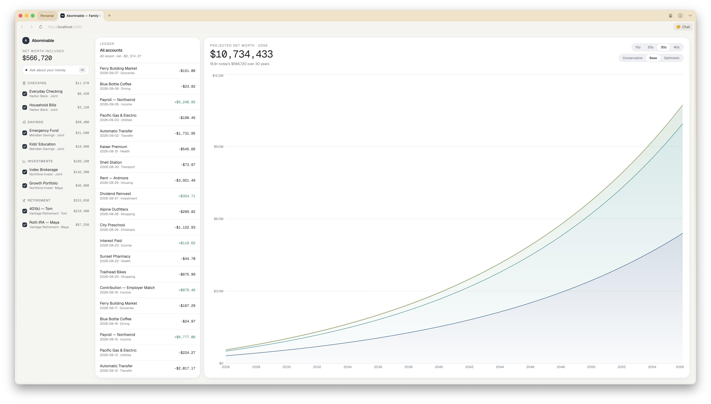
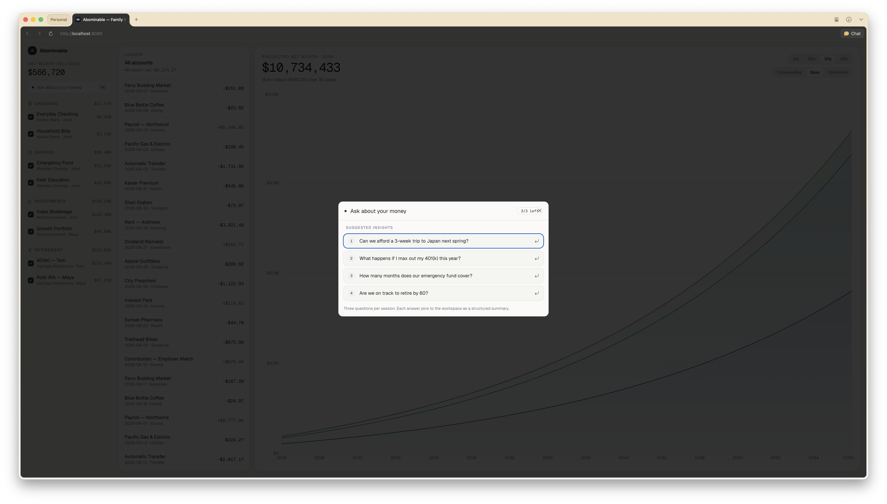
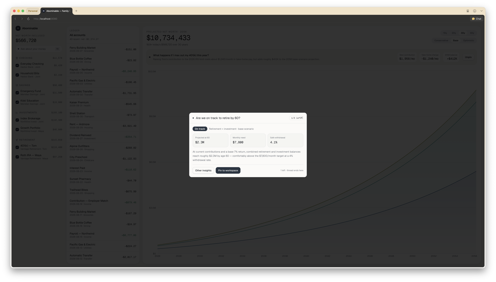
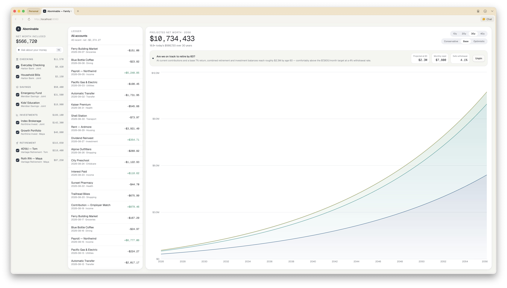

# Abominable

Minimal personal and family finance workspace with long-term wealth projections.

Most finance apps focus on one of two things:

- Gamify investments to try to extract value from your financial anxieties
- Synthesize your financial profile across multiple imported accounts, but just show it to you as a pane of glass that you can't touch

Abominable is meant to focus, instead, on two things:

- Give you a focused, long-term view of your financial profile across multiple imported accounts
- Connect that financial profile with modern AI tools to allow you to interact with and understand your accounts

As development on Abominable progresses, we'll integrate AI tooling more deeply into our platform. As we do so, our guiding principles will be the following:

- You should be able to easily chat with AI agents about the state of your finances
- You shouldn't be able to let your anxieties about your finances spiral through unlimited conversations with agentic enablers

## What does Abominable look like?

#### Homepage



#### Example AI interaction dialogues




#### Example homepage with pinned AI conversation details


## Development

You need Node.js and npm — [install with nvm](https://github.com/nvm-sh/nvm#installing-and-updating).

```sh
git clone <this-repository-url>
cd <repository-name>
npm i
npm run dev
```

## Built with

- TanStack Start
- TypeScript
- React
- Tailwind CSS

Prototyped with Lovable, generalized with Claude.
